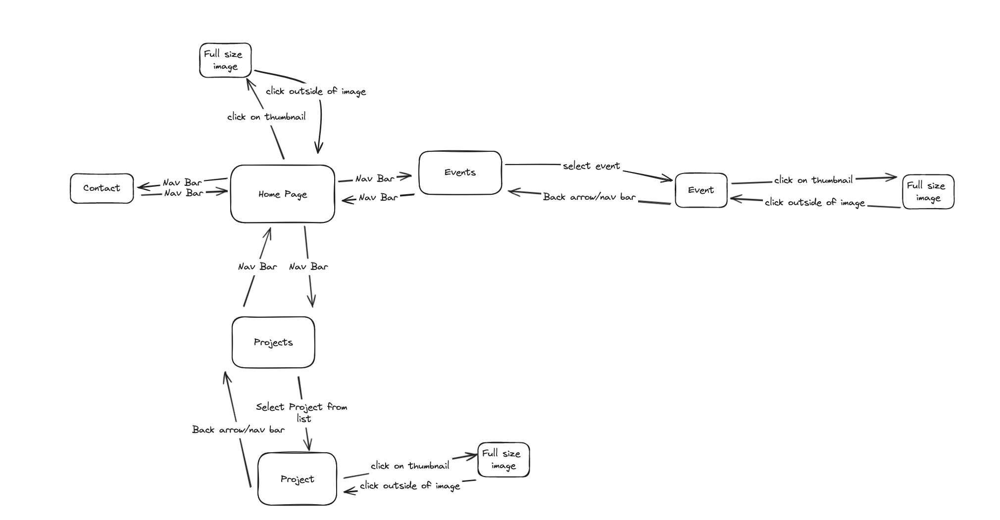
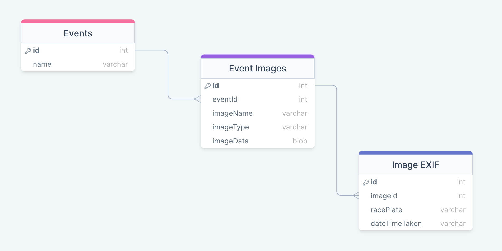
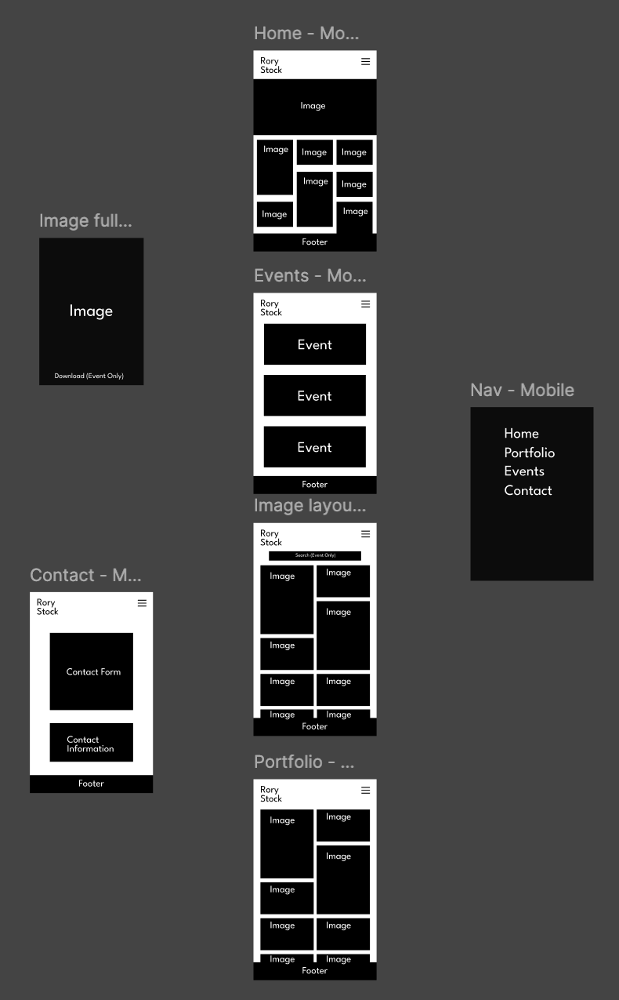
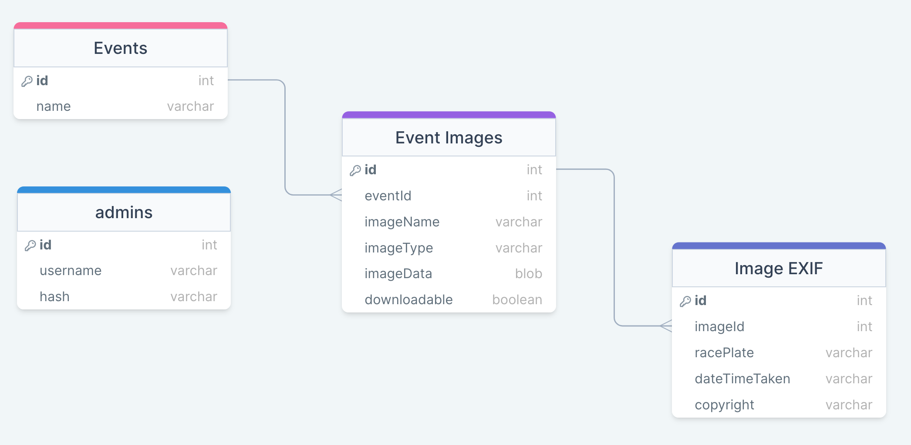

# Development of a Database-Driven Web Application for NCEA Level 3

Project Name: **Photography Portfolio Website**

Project Author: **Rory Stock**

Assessment Standards: **91902** and **91903**

-------------------------------------------------

## Documentation

- [Home](README.md)
- [Design and Review](Design.md)

-------------------------------------------------

## Design, Development and Testing Log

### Friday 30th May

Getting the image download function working

I spent quite a lot of time trying to use the google drive api to allow site users to download images however I was struggling to get this to work. I want through a number of different services and options and have ended up using cloudflare r2 storage and the s3 api through the laravel framework to give a download button. This doesn't need any of google's oauth2 authentication making it much simpler to implement. When I use this function in the website I will create a variable for the image name/path instead of a static preselected image seen in the example below.

> No user feedback relevant for this.

### Friday 31st May

Working on site flow using Excalidraw.

Started designing how the user will navigate between pages, and making sure that there are no dead ends in the site.  
This is only the user interface, I still need to make an admin interface to allow for uploading and managing the site.

> Users happy with site flow at the moment, as the site progresses this may get modified slightly, but the site does not demand a particularly complex layout. I will however get user more user feedback for when I design the admin interface.

### Friday 31st May

Database design with DrawSQL

Started designing the database for the website. I may need to add more tables to the Image EXIF data table as I am not sure how many filters I will want. Admin accounts/security still need to be added.

> No particularly relevant user feedback, just making sure that any relevant image IPTC/copyright data is included in the database.

### Friday 31st May

Site Design with Figma

Made a draft design of the mobile and desktop versions of the site. It follows the same flow that I made in excalidraw.  
This is only the user interface, I still need to make an admin interface to allow for uploading and managing the site.

Mobile Site:

Desktop Site:

It is not shown in the screenshots but on the figma preview each page is interactive and you can click through the site.

> Site design feedback: The home page should have one main large image then other smaller images below it with a non-symmetrical layout. They also asked about copyright. At the bottom of each page I will add a copyright notice specifying ownership of the site/images. We also discussed the background and accent colours used on the site. We went through a few different options and agreed that a simple black/white/grey them is best as it allows the main content of the site, images to stand out. We decided to use white as the background as mountain bike photos tend to have darker colours and a white background would create a good contrast. We also discussed about whether or not there should be an about page, we thought that it would be a good idea to add in the future, but that there would not be enough to put in it at the moment.

Edited the mobile and desktop site designs to reflect the feedback. I also changed the projects page to a just an image gallery page which is more relevant at the moment. A projects page may be added in the future if there is enough content to put on it.

Updated Mobile Site:

Updated Desktop Site:

### Thursday 6th June

Admin section of database with DrawSQL

Added an admin table to my DrawSQL database design. To ensure admin security no passwords will be stored on the database, instead the passwords will be hashed and the hash will be stored.

> No user feedback relevant for this.

### DATE HERE

Replace this test with what you are working on

Replace this text with brief notes describing what you worked on, any decisions you made, any changes to designs, etc. Add screenshots / links to other media to illustrate your notes where necessary.

> Replace this text with any user feedback / comments

Replace this text with notes describing how you acted upon the user feedback: made changes to design, etc.
